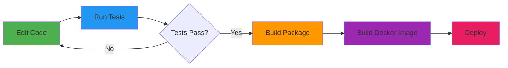

# ComLine Edge Service

A Spring Boot microservice that provides a REST API for accessing ComLine product information. This service acts as an edge layer between clients and the ComLine API, providing data transformation, validation, and monitoring capabilities.

[](https://openjdk.org/projects/jdk/21/)
[](https://spring.io/projects/spring-boot)
[](https://maven.apache.org/)
[](LICENSE)

## Architecture Overview

```mermaid
graph TB
    subgraph "Client Layer"
        CLIENT[Client Applications]
    end

    subgraph "ComLine Edge Service"
        API[REST API<br/>ProductsController]
        SERVICE[Business Logic<br/>ComlineProductService]
        MAPPER[Data Mapping<br/>ProductMapper]
        CONFIG[Configuration<br/>Properties & WebClient]

        API --> SERVICE
        SERVICE --> MAPPER
        SERVICE --> CONFIG
    end

    subgraph "External Services"
        COMLINE[ComLine API<br/>ctofinder.comline-shop.de]
    end

    subgraph "Observability"
        METRICS[Micrometer Metrics]
        PROMETHEUS[Prometheus Endpoint]
        ACTUATOR[Spring Actuator]

        SERVICE --> METRICS
        METRICS --> PROMETHEUS
        ACTUATOR --> PROMETHEUS
    end

    CLIENT -->|HTTP GET /api/v1/products/{ctoNr}| API
    SERVICE -->|WebClient| COMLINE
    COMLINE -->|JSON Response| SERVICE
    SERVICE -->|Product DTO| MAPPER
    MAPPER -->|Product Model| API
    API -->|JSON Response| CLIENT

    style API fill:#4CAF50
    style SERVICE fill:#2196F3
    style MAPPER fill:#FF9800
    style COMLINE fill:#9C27B0
    style PROMETHEUS fill:#E91E63
```

## Component Description

### REST API Layer (`ProductsController`)
- **Endpoint**: `GET /api/v1/products/{ctoNr}`
- **Parameters**:
  - `ctoNr` (path): CTO Number (Configure-To-Order number)
  - `accessToken` (query): Authentication token for ComLine API
- **Response**: Product information in JSON format
- **OpenAPI**: Fully documented with Swagger annotations

### Business Logic Layer (`ComlineProductService`)
- Orchestrates calls to ComLine API
- Handles response parsing and validation
- Implements retry logic and error handling
- Tracks metrics (success/failure counters)
- Validates CTO number matching

### Data Mapping Layer (`ProductMapper`)
- MapStruct-based DTO to model conversion
- Handles type conversions (OffsetDateTime → LocalDate)
- URL normalization (protocol-relative URLs)
- Null-safe transformations

### Configuration
- **WebClient**: Reactive HTTP client for external API calls
- **Properties**: Externalized configuration for ComLine API
- **Jackson**: JSON processing with Java 8 date/time support
- **Actuator**: Health checks and metrics endpoints

## Technology Stack

- **Java 21** - Latest LTS version
- **Spring Boot 3.4.0** - Application framework
- **Spring WebFlux** - Reactive HTTP client
- **MapStruct 1.6.3** - DTO mapping
- **Spock 2.4** - Testing framework (Groovy)
- **JaCoCo** - Code coverage (85%+)
- **OpenAPI Generator** - API-first development
- **Micrometer** - Metrics and observability
- **Prometheus** - Metrics export

## Getting Started

### Prerequisites

- **Java 21** or higher
- **Maven 3.8+**
- **Docker** (optional, for containerized deployment)

### Configuration

Configure the ComLine API connection in `src/main/resources/application.yml`:

```yaml
comline:
  api:
    base-url: ${COMLINE_BASE_URL:https://ctofinder.comline-shop.de/4DCGI/direct}
    mid: 219
    action: getCTOConf
    customerNumber: ${COMLINE_CUSTOMER_NUMBER:your-customer-number}
    password: ${COMLINE_PASSWORD:your-password}
```

Environment variables:
- `COMLINE_BASE_URL` - ComLine API endpoint (optional)
- `COMLINE_CUSTOMER_NUMBER` - Your customer number (required)
- `COMLINE_PASSWORD` - Your API password (required)

## Building the Project

### Standard Build
```bash
# Build and run tests
mvn clean install

# Build without tests
mvn clean package -DskipTests

# Run tests only
mvn test

# Check code coverage
mvn clean test jacoco:report
# Report available at: target/site/jacoco/index.html
```

### Docker Build

See [DOCKER.md](DOCKER.md) for detailed Docker build instructions.

```bash
# Build Docker image to tarball (no Docker daemon required)
mvn clean package jib:buildTar

# Build and push to Docker registry
mvn clean package jib:build

# Multi-platform build (amd64 + arm64)
mvn clean package jib:build -Pmultiplatform
```

### Publishing Artifacts

```bash
# Publish Maven artifacts to GitHub Packages
mvn clean deploy

# Publish both Maven artifacts and Docker image
mvn clean deploy jib:build -Pmultiplatform
```

## Running the Application

### Local Development

```bash
# Run with Maven
mvn spring-boot:run

# Run with custom configuration
mvn spring-boot:run -Dspring-boot.run.arguments="--comline.api.customerNumber=12345 --comline.api.password=secret"

# Run the JAR
java -jar target/comline-edge-0.0.1-SNAPSHOT.jar
```

### Docker

```bash
docker run -p 8080:8080 \
  -e COMLINE_CUSTOMER_NUMBER=your-customer-number \
  -e COMLINE_PASSWORD=your-password \
  ghcr.io/conrad-ccp/comline-edge:latest
```

## API Documentation

Once the application is running, access the API documentation at:

- **Swagger UI**: http://localhost:8080/swagger-ui.html
- **OpenAPI Spec**: http://localhost:8080/v3/api-docs
- **OpenAPI YAML**: Available in JAR at `META-INF/openapi/comline-api.yaml`

### Example Request

```bash
curl -X GET "http://localhost:8080/api/v1/products/CZ1FU-013020?accessToken=your-token" \
  -H "accept: application/json"
```

### Example Response

```json
{
  "productIdentifier": "CZ1FU-013020",
  "name": "Apple MacBook Pro 16'' SpaceSchwarz CTO M4 Pro",
  "description": "CTO Variante der Grundkonfiguration MX2Y3D/A",
  "databasePrice": 3610.97,
  "retailPrice": 4899,
  "recommendedRetailPrice": 4116.81,
  "manufacturerProductNumber": "Z1FU-013020",
  "ean": "4069116466182",
  "length": 0.4,
  "width": 0.075,
  "height": 0.29,
  "netWeight": 2.1,
  "productWeight": 3.5,
  "grossPrice": 4899,
  "deliveryDate": "2025-11-06",
  "url": "https://ezentrum-res.cloudinary.com/image/upload/v1730460185/comline/nj7tg26s7sjjny01rcfj.jpg",
  "productImage": "https://ezentrum-res.cloudinary.com/image/upload/v1730460185/comline/nj7tg26s7sjjny01rcfj.jpg"
}
```

## Monitoring and Observability

### Health Check
```bash
curl http://localhost:8080/actuator/health
```

### Metrics
```bash
# All metrics
curl http://localhost:8080/actuator/metrics

# Specific metric
curl http://localhost:8080/actuator/metrics/comline.api.calls

# Prometheus format
curl http://localhost:8080/actuator/prometheus
```

### Available Metrics

- `comline.api.calls` - Counter for API calls (tagged by result: success/failure)
- `comline.api.get.product.by.cto.nr` - Timer for product retrieval operations

## Testing

The project uses Spock Framework for testing with comprehensive coverage:

```bash
# Run all tests
mvn test

# Run specific test
mvn test -Dtest=ProductsControllerSpec

# Run with coverage report
mvn clean test jacoco:report
```

### Test Coverage

- **Overall Coverage**: 85%
- **Controller Layer**: 100%
- **Service Layer**: 100%
- **Mapper Layer**: 98%

Test suites:
- `ProductsControllerSpec` - REST API tests (7 tests)
- `ComlineProductServiceSpec` - Service layer tests (5 tests)
- `ProductMapperSpec` - Mapping tests (15 tests)

## Project Structure

```
comline-edge/
├── src/
│   ├── main/
│   │   ├── java/de/conrad/ccp/comline/
│   │   │   ├── config/          # Configuration classes
│   │   │   ├── controller/      # REST controllers
│   │   │   ├── dto/             # Data Transfer Objects
│   │   │   ├── exception/       # Exception handlers
│   │   │   ├── mapper/          # MapStruct mappers
│   │   │   ├── service/         # Business logic
│   │   │   └── ComLineEdgeApplication.java
│   │   └── resources/
│   │       ├── openapi/         # OpenAPI specification
│   │       └── application.yml  # Configuration
│   └── test/
│       └── groovy/de/conrad/ccp/comline/
│           ├── controller/      # Controller tests
│           ├── mapper/          # Mapper tests
│           └── service/         # Service tests
├── target/
│   ├── generated-sources/       # OpenAPI generated code
│   └── site/jacoco/             # Coverage reports
├── DOCKER.md                    # Docker documentation
├── README.md                    # This file
└── pom.xml                      # Maven configuration
```

## Code Generation

The project uses OpenAPI Generator to generate API interfaces and models:

```bash
# Generate API code (automatic during compile)
mvn clean compile

# View generated code
ls -la target/generated-sources/openapi/src/main/java/de/conrad/ccp/comline/api/
```

Generated artifacts:
- `ProductsApi.java` - API interface
- `Product.java` - Product model
- `ErrorResponse.java` - Error model
- `ApiUtil.java` - Utility classes

## Development Workflow



1. **Develop**: Edit source code in `src/main/java/`
2. **Test**: Run tests with `mvn test`
3. **Build**: Package with `mvn package`
4. **Containerize**: Build Docker image with Jib
5. **Deploy**: Push to registry or run locally

## Performance Characteristics

- **Startup Time**: ~3-5 seconds
- **Memory Usage**:
  - Initial: 256MB
  - Maximum: 512MB
- **Response Time**: <100ms (excluding external API latency)
- **Throughput**: ~1000 req/s (limited by external API)

## Security Considerations

- Passwords and tokens in environment variables (not in code)
- Non-root container user (UID 1000)
- No sensitive data in logs (URL sanitization)
- HTTPS for external API calls
- Input validation via Bean Validation

## Troubleshooting

### Common Issues

**Build fails with "Java version mismatch"**
```bash
# Check Java version
java -version
# Should be 21 or higher

# Set JAVA_HOME
export JAVA_HOME=/path/to/jdk-21
```

**Tests fail with ObjectMapper date/time error**
- Ensure `jackson-datatype-jsr310` is configured
- Check `JacksonConfig` registers `JavaTimeModule`

**Docker build fails with multi-platform error**
```bash
# Use single platform build or push to registry
mvn jib:buildTar  # Single platform
mvn jib:build -Pmultiplatform  # Multi-platform (requires registry)
```

**Connection timeout to ComLine API**
- Check network connectivity
- Verify `COMLINE_BASE_URL` configuration
- Check firewall rules

**Netty DNS resolver warning on macOS**
- The project includes `netty-resolver-dns-native-macos` dependency
- This eliminates DNS resolution warnings on macOS (both Intel and Apple Silicon)
- No action required - already configured in pom.xml

## Contributing

1. Fork the repository
2. Create a feature branch (`git checkout -b feature/amazing-feature`)
3. Commit changes (`git commit -m 'Add amazing feature'`)
4. Push to branch (`git push origin feature/amazing-feature`)
5. Open a Pull Request

### Code Style
- Java: Follow Google Java Style Guide
- Maximum line length: 120 characters
- Use Lombok for boilerplate code
- Write tests for all new features

## License

Proprietary - Conrad CCP

## Support

For issues and questions:
- **Issues**: GitHub Issues
- **Email**: support@conrad-ccp.de
- **Documentation**: See [DOCKER.md](DOCKER.md)

## Changelog

### Version 0.0.1-SNAPSHOT
- Initial release
- Product retrieval by CTO number
- ComLine API integration
- Metrics and monitoring
- Docker support with Jib
- 85% code coverage
